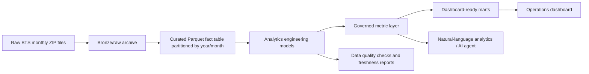

# Architecture

## Goal

Build a portfolio-grade analytics product over BTS on-time flight data that can scale from a local Q1 2019 sample to the full 1987-2026 historical archive.

## Target System

## Design Choices

- Partition by `year` and `month` because the source arrives as monthly extracts and most historical analysis naturally filters by time.
- Store curated data in Parquet because it is columnar, compressed, and engine-neutral.
- Keep raw files immutable so every derived layer can be regenerated.
- Serve dashboard queries from aggregate marts rather than scanning 100M+ fact rows interactively.
- Define metrics centrally so the dashboard, reports, and future AI layer use the same business logic.

## Local Implementation

The current implementation is intentionally local-first:

- `src/build_lakehouse.py` creates partitioned Parquet files under `outputs/lakehouse/curated/fact_flight_performance`.
- `models/` defines the dbt analytics engineering layer: staging, marts, tests, exposures, and reusable metric logic.
- `src/build_flight_reliability.py` generates dashboard-ready CSV marts and executive figures for the local no-dbt fallback.
- `src/run_quality_checks.py` validates the curated fact table and writes quality reports.
- `src/build_dashboard.py` generates the dashboard HTML from the processed marts.

## Production Upgrade Path

- Replace local filesystem storage with S3, GCS, ADLS, or OSS-compatible object storage.
- Use Iceberg or Delta Lake table format for schema evolution and transactional writes.
- Run transformations in DuckDB locally, or BigQuery, Snowflake, Databricks, Spark, or Flink at larger scale.
- Promote the included dbt scaffold into the production transformation layer with CI checks on every pull request.
- Add orchestration with Airflow, Dagster, Prefect, or managed cloud workflows.
- Add observability for freshness, volume changes, null-rate drift, schema drift, and dashboard latency.
- Add a semantic layer for governed metrics and AI-safe analytics.
